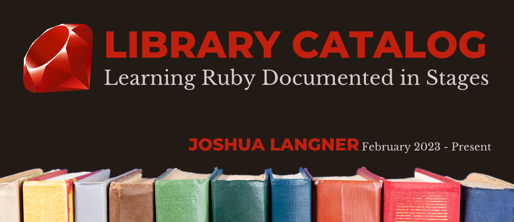

---

## Library Catalog — _Learning Ruby Documented in Stages_

### Joshua Langner

##### Februrary 2023 - Present

| [LinkedIn](https://www.linkedin.com/in/josh-langner-48) | [GitHub](https://github.com/jlangner87) | [Portfolio](https://joshua-langner.com) |

---

### **_About This Repo:_**

In a proactive effort to grow my skills and make myself a more valuable asset to future employers, I have taken on learning a new tech stack. **My goal** is to be proficient in developing dynamic ReactJS applications that utilize Ruby on Rails for Backend by the end of April 2023.

This repo contains multiple iterations of one project— each project demonstrating the practical application of the fundamentals of Ruby at that stage of learning.

I learn by doing. At each stage of learning, I pause and put my new knowledge to work with practical-application projects. Through the learning process, I recognize areas where my projects can be improved.

Rather than eliminating the early iterations, I chose to keep them side-by-side, so that I could have linear documentation of incremental growth.

---

### **_Stage 1: Fundamentals of Ruby_**

file: _library_hashes.rb_

##### Key Principles Used

- Arrays
- Hashes
- Methods
- Loops

##### Overview

In this project, I created a library array where I stored books as hashes.
I used for loops and if/else statements to create a control flow. Then I created search methods that take user CLI input as arguments and return the desired data.

---

### **_Stage 2: Intro to Object Oriented Programming in Ruby_**

file: _library_classes.rb_

##### Key Principles Used

- Class
- Initialize method
- Getter Methods
- Setter Methods

##### Overview

The book data could be so much more robust and useful if they were programmed as objects in a Book class. I also refactored the overall structure of the code to improve the readability.

Once I had the program set up this way, it opened up a couple of new ideas that I was able to quickly implement.

- I set an attribute that indicated whether the book was checked in or out.
- I set an attribute that provided data about who had the book checked out.
- I created a method for checking the availability status of the book.
- I created a checkout method (switch the status from "available" to "checked out" and add the user's name to the bookholedr attribute)

---

### **_Future Iterations_**

I am currently (as of 03/28/2023) adding a CardHolder class where library card holders can be stored. Then the program will check if the user is a member before allowing them to check out the book.

A method that adds books to the CardHolder object when a book is checked out and removes them when the book is checked back in.

A LibraryStaff class where library staff can be stored as objects.

An admin control flow that is only accessible to users in the Library Staff class. Methods to add (Create) books, edit book information (update), and take books out of circulation (delete).

End goal: Move away from CLI interaction and have a fully functioning frontend for users to interact with.

---

### **_Technologies Used_**

- Ruby
- Rails

---

### **_Resources_**

- [Ruby Docs](https://www.ruby-lang.org/en/documentation/)
- [Launch School](https://launchschool.com/books/ruby)
- [CodeCademy](https://www.codecademy.com/learn/learn-ruby/modules/learn-ruby-introduction-to-ruby-u/cheatsheet)
- [Udemy](https://www.udemy.com/course/the-complete-ruby-on-rails-developer-course/learn/)
